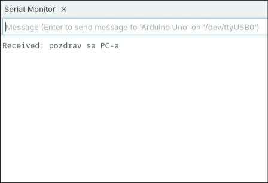
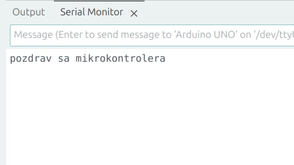
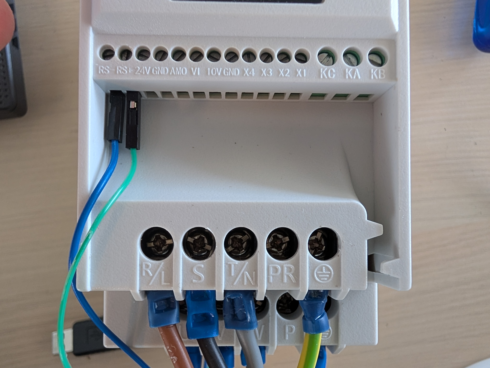
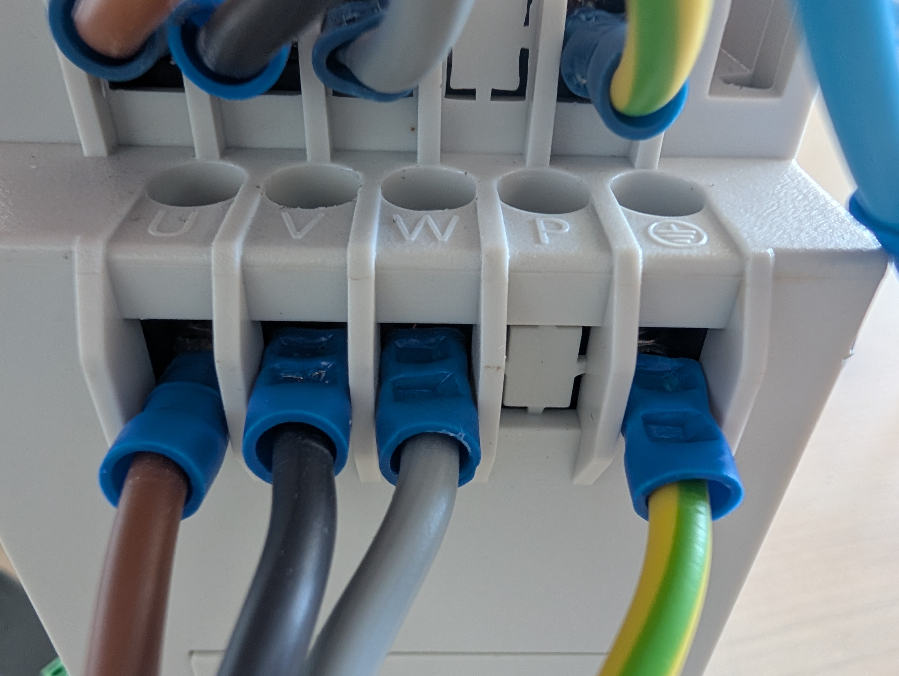
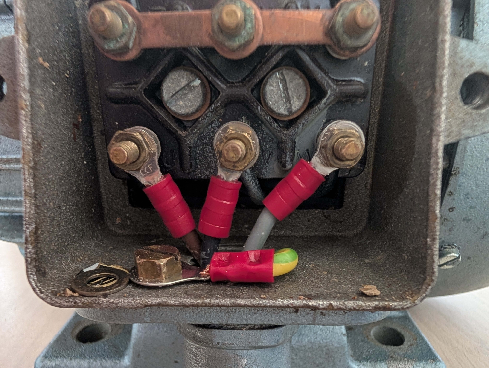

# RS-485 Modbus Control of a VFD-Driven Asynchronous Motor

**Status:** Done - check out the demo video [here](https://youtube.com/shorts/K-A4y2HU37A?feature=share)

## 1. Overview

This project replaces the front-panel control of a VFD (variable frequency drive) with
direct control over an RS-485 / Modbus-RTU link from a PC, in order to start/stop and
set the speed of a three-phase asynchronous AC motor programmatically. The VFD is a
generic SW100-series AC drive.

Final result: `vfd_rs485_controller.py`, a small `VFD` class wrapping `pymodbus` that can
connect to the drive, start/stop it, set a target frequency, and read back live operating
values (frequency, voltage, current, power, torque %).

## 2. Hardware Summary

| Item | Detail |
|---|---|
| VFD | SW100-1R5G3B AC drive, Modbus-RTU over RS-485 |
| Motor | Asynchronous AC motor — `[1PH 220V/3PH 380V, 0.55kW - 0.75HP]` |
| RS-485 adapter | USB-RS485 dongle |
| Host | PC, Python 3 + `pymodbus` |
| Mains supply | 3PH 380V |

VFD communication settings used (all left at factory default — see §5):

| Setting | Value |
|---|---|
| Protocol | Modbus-RTU |
| Slave address | 1 |
| Baud rate | 9600 |
| Data format | 8 data bits, no parity, 1 stop bit |

These match the `ModbusSerialClient` parameters in the controller (`baudrate=9600`,
`bytesize=8`, `parity='N'`, `stopbits=1`), so no communication parameters had to be
changed on the drive — only the *command source* parameters (§5).

## 3. Project Timeline

### 3.1 RS-485 dongle testing (PC <=> PC, PC <=> microcontroller)

Before wiring anything to the VFD, the USB-RS485 dongle(s) were validated independently:
first PC-to-PC (loopback / two dongles talking to each other) and then PC-to-microcontroller,
to rule out dongle or driver issues before introducing the drive itself.

Testing was done using the serial motor of the Arduino IDE.

 

Test code:

```
#include <SoftwareSerial.h>

#define DE_RE_PIN 8
#define RS485_RX  3   // RO → pin 3
#define RS485_TX  2   // DI → pin 2

SoftwareSerial RS485(RS485_RX, RS485_TX);

void setup() {
  Serial.begin(9600);
  RS485.begin(9600);
  pinMode(DE_RE_PIN, OUTPUT);
  digitalWrite(DE_RE_PIN, LOW);  // Start in receive mode
}

void loop() {
  if (Serial.available()) {
    String msg = Serial.readStringUntil('\n');
    digitalWrite(DE_RE_PIN, HIGH);  //  setting to send mode
    RS485.println(msg);
    delay(10);
    digitalWrite(DE_RE_PIN, LOW);   //  setting back to receive
  }

  if (RS485.available()) {
    String incoming = RS485.readStringUntil('\n');
    Serial.println("Received: " + incoming);
  }
}
```

### 3.2 Wiring the VFD to a three-phase outlet

The drive's mains input was wired to a three-phase outlet per its nameplate rating. Outlet voltage is 3PH 380V.

> Be sure to check your model number before wiring up the VFD to a power outlet. Depending on if the 
> model number ends in `G1`, `G2` or `G3` it'll have different supported input ranges, from 1PH 200-240V to 3PH 380-480V. 
> Confirm the exact power rating from the units nameplate before connecting power.

### 3.3 Wiring the USB RS-485 dongle to the VFD

The dongle's A/B (D+/D−) lines were connected to the VFD's RS-485 terminals.



### 3.4 Establishing a connection and reading first values

Using `pymodbus`'s `ModbusSerialClient`, a connection was opened to the drive and the first
holding registers were read back (operating frequency, output voltage, current, power,
torque %) — see the register map in §4. This confirmed the wiring and serial parameters
were correct before any control was attempted.

### 3.5 Switching the VFD from panel control to communication control

By default the drive takes its run/stop commands from the front operator panel and its
frequency setpoint from the panel's keypad potentiometer. To let RS-485 take over, two
function-code parameters were changed:

| Parameter | Name | Factory default | Set to |
|---|---|---|---|
| `P00.02` | Command Source Selection | `0` (Operational Panel Control) | `2` (Communication setting) |
| `P00.03` | Main Frequency Source X Selection | `4` (Keyboard Potentiometer) | `9` (Communication setting) |

With `P00.02 = 2` and `P00.03 = 9`, the run/stop/jog command word register (`0x2000`) and
the frequency setpoint register (`0x1000`) — the two registers the controller writes to —
become the drive's actual command source instead of the panel buttons.

### 3.6 Writing a test routine in Python

A test loop was written directly against `ModbusSerialClient`: start the
drive, set the target frequency, and poll the operating-frequency register until it reaches 
the target before printing a full set of readings, and do that for the following frequencies:
15.00Hz, 30.00Hz, 50.00Hz. After reaching all target frequencies, the routine stops the VFD 
and exits.

### 3.7 Wiring the VFD to the AC motor

With communication control verified on an unloaded drive, the output terminals (U/V/W)
were wired to the eponymous terminals on the motor.

 

### 3.8 Re-running tests after wiring the motor

The same test routine from §3.6 was re-run with the motor connected, to confirm correct
rotation direction and that frequency/current/power readings behaved as expected under
load.

No issues were present.

### 3.9 Cleaning up the Python controller

After a successful test run, the ad-hoc script was refactored into a reusable `VFD` 
class with a CLI implementation

## 4. Modbus Register Map (as used by the controller)

All addresses below are confirmed against the drive's Modbus-RTU appendix.

| Constant in code | Address | R/W | Manual description |
|---|---|---|---|
| `SET_FREQUENCY_REG` | `0x1000` | W | Communication frequency setpoint (decimal, two implied decimal places — `5000` = `50.00Hz`) |
| `OPERATING_FREQ_REG` | `0x1001` | R | Operating frequency |
| `OUTPUT_VOLTAGE_REG` | `0x1003` | R | Output voltage |
| `OUTPUT_CURRENT_REG` | `0x1004` | R | Output current |
| `OUTPUT_POWER_REG` | `0x1005` | R | Output power |
| `OUTPUT_TORQUE_PERCENTAGE_REG` | `0x1006` | R | Output torque % |
| `CONTROL_COMMAND_REG` | `0x2000` | W | **Control command word** (run/stop/jog) — see note below |

Control command word values used (written to `0x2000`):

| Constant | Value | Manual meaning |
|---|---|---|
| `VALUE_FOR` | `0x0001` | FOR (forward) run |
| `VALUE_REV` | `0x0001` | REV (reverse) run |
| `VALUE_STOP` | `0x0006` | Deceleration stop (controlled ramp-down, not a free/coast stop) |

## 5. Communication Parameters (P07 group) — left at factory default

For completeness, these are the drive-side communication parameters; none needed to
change since the controller already uses the matching factory-default values.

| Parameter | Name | Default | Meaning |
|---|---|---|---|
| `P07.30` | Communication Protocol | `0` | Modbus-RTU |
| `P07.31` | Address | `1` | Slave address (1–247 for Modbus-RTU) |
| `P07.32` | Baud Rate | `5` | 9600 baud |
| `P07.33` | Digital Form | `0` | No parity, 1 stop bit |
| `P07.03` | Communication Timeout Time | `1` (s) | How long without a message before a comms-fault is raised |
| `P07.04` | Communication Timeout Function | `0` | Action on timeout (`0` = invalid/disabled here) |
